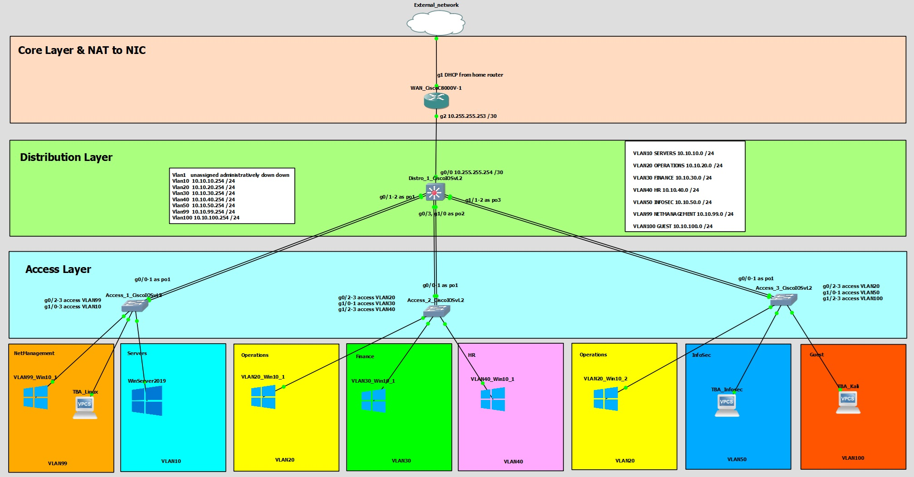
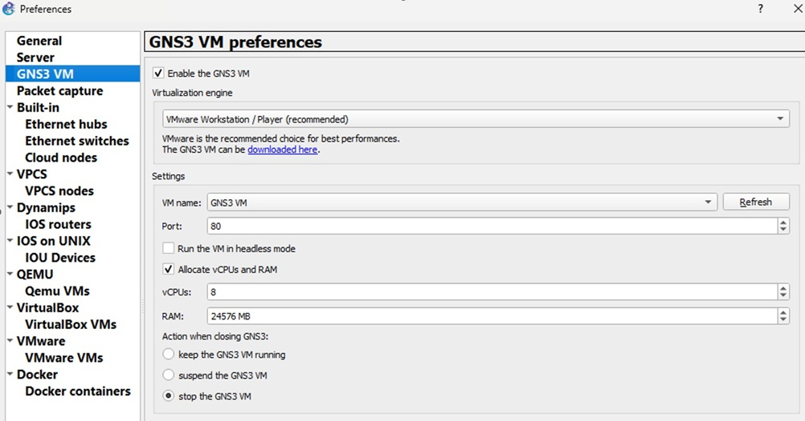
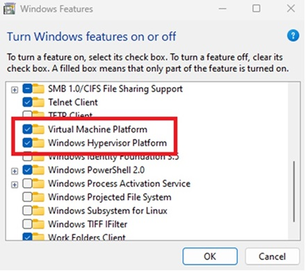

# Enterprise Domain Lab: networking - virtualization - security

## Purpose

This lab simulates a medium-sized enterprise IT infrastructure using GNS3 and VMware.
It is designed to demonstrate and practice skills in:
- Virtualization
- Networking
- System administration
- Cybersecurity blue team and red team practices

The project is shared publicly as a showcase of my technical skills and as a resource for anyone who wants to experiment with enterprise networking and cybersecurity in their own lab.

---

## Devices

1.	1 WAN router – connected with my actual physical NIC
2.	1 distribution switch routing between the VLANS
3.	3 access switches managing the VLAN traffic
4.	Windows Server 2019 for main services like domain control, DNS, DHCP - TBA
5.	End-point machines; majority Windows 10 and some Linux distributions - TBA
6.	1 internal Kali attacker & 1 external Kali attacker – TBA
7.	Splunk, Snort, Pfsense as security tools – TBA

---

## Network design

1.	OSPF running between the WAN router and distro switch
2.	NAT setup between WAN router and external network
3.	VLANs & subnets:
	- VLAN10 Servers 10.10.10.0 /24
	- VLAN20 Operations 10.10.20.0 /24
	- VLAN30 Finance 10.10.30.0 /24
	- VLAN40 HR 10.10.40.0 /24
	- VLAN50 Infosec 10.10.50.0 /24
	- VLAN99 NetManagement 10.10.60.0 /24
	- VLAN100 Guest 10.10.70.0 /24
4.	LACP Etherchannels between distribution switch and access switches
5.	LLDP and CDP between all network devices *Sadly LLDP doesn't work on Cisco IOSvL2 switches
6.	STP; distro switch as root, portfast and bpduguard on downlinks to end-devices
7.	ACL to separate Guest network
8.	VTP transparent

**TBA:**

9.	DHCP
10.	DNS
11.	NTP
12.	LLDP agent on servers
13. ACLs to limit access between departments
14.	Port security, DHCP snooping, APR inspection
15.	SSH, FTP, TFTP connection to network devices
16. SNMP

---

## Host hardware

- SSD Lexar NM790 4TB M.2 2280 – I dedicated 3TB drive for the project, keeping my host OS on the same disk to ensure the best cooperation between the host OS and VMs
- AMD Ryzen 7 5800X 8-Core Processor, 3801 Mhz, 8 Cores, 16 Logical Processors
- 64 GB RAM Patriot Viper Steel, DDR4, 16x4 GB, 3200MHz, CL16

---

## Topology

---

## Setup
The lab environment is built on my personal computer, running on my Win11 OS as the host OS.
After some considerations between GNS3 and Eve-Ng for network virtualization, the user interface and community support convinced me to GNS3. For now I just want to host the lab on my PC, no need to share the access to it. If I ever decide to rebuilt it on a separate server, I might migrate it to Even-Ng. 
For running the end-point VMs and GNS3 VM I use VMware Workstation. GNS3 VM runs all network devices + Windows Server.

I used Cisco Packet Tracer to create a testing environment.

---

## GNS3 + VMware configuration

Building up proper architecture of images of the network devices requires using GNS3 VM. That’s a purpose-built Linux VM that handles all these devices properly. Earlier I did some tests with Oracle Virtual Box, which couldn’t handle it. Key point here were:
- installing VMware Workstation
- installing VMware VIX
- downloading GNS3 VM from GNS3 website
- proper setup of GNS3; especially for server preferences and gns3 vm preferences to choose the same port that listens on GNS3 VM in VMware

---

## Dualboot

For my regular PC usage, I use WSL2. For this purpose I keep the Hyper-V enabled at Windows boot. This led to an issue. When Hyper-V is enabled, it locks the CPU’s virtualization engine, so other hypervisors like VMware can’t use it properly.
Turning it off would disable my WSL2. For this purpose I decided for a workaround – setting up a dualboot that allows:
- Default boot mode with Hyper-V enabled
- Secondary boot mode with Hyper-V disabled

Hyper-V can be checked in msinfo menu:

Useful commands here:
- `bcdedit /enum`
to see all the boot entries. By default there should be one
- `bcdedit /copy {default} /d "new-boot-entry-name"`
to copy the current boot entry
- `bcdedit /set {boot-entry-number} hypervisorlaunchtype off`
to turn off the hypervisor for the secondary boot entry

At this point I could restart PC to use the secondary boot (shift + restart button) but Hyper-V was remained enabled. Below two Windows features had to be enabled:

Unchecking the features in GUI results in Hyper-V being disabled in both boot entries. I had to come up with some more handy solution so I prepared 2 scripts to toggle those 2 features and automatically reboot into the Advanced Startup Menu, so I can easily switch between my regular boot and boot for the lab purposes.

## Virtual Machines and allocated resources

- Cisco 8000V used as core router // 6144mb RAM and 2vCPU
- 1 x Cisco IOSvL2 used as distribution switch // 1024mb RAM and 1vCPU
- 3 x Cisco IOSvL2 used as access switches // 1024mb RAM and 1vCPU each
